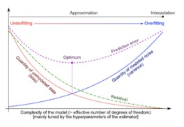
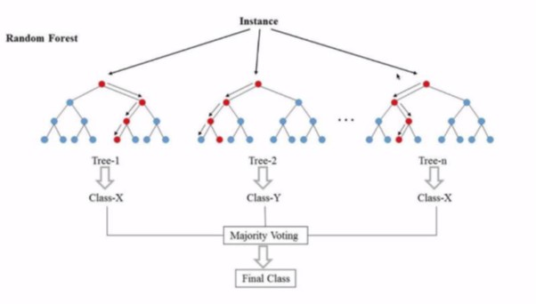
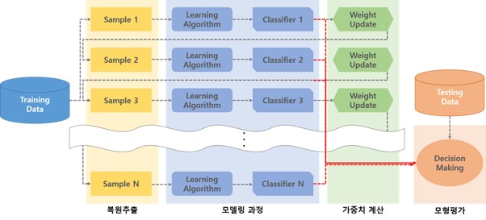
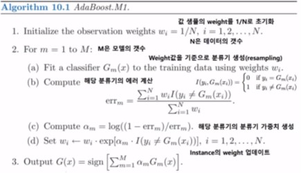
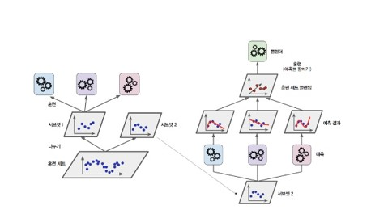

## introduction to ensemble

 
 
**에러는 bias와 variance로 구성이 된다.**  
**bias**는 실제 value와 예측 value와의 차이가 어느 정도되는 지 파악하는 데 사용된다.  
high bias는 underfitting 되었음을 의미한다.  
**variance**는 quantifies how are the prediction made on same observation different from each other.  
high variance는 overfitting 되었음을 의미한다.  
 

bias와 variance 사이에는 trade-off 관계가 있기 때문에, 
모델은 반드시 두 종류의 error(bias, variance) 사이의 균형을 유지해야 한다.   
(=bias와 variance의 합이 가장 작은 지점이 optimal point가 된다.)
**ensemble learning is one way to execute this bias-variance trade off analysis.** 
 
여기서 ensemble learning은 무엇인가? ensemble은 group of predictors을 이용하는 방법이다. 
복잡한 문제를 다수에게 물어보고, 그들의 결과를 aggregate한다고 가정하자. 이러한 경우에 aggregated된 답이 한 전문가의 답변보다 더 낫다는 것을 발견하게 될 것이다. 이것을 군중의 지혜라고 부르는데 이와 유사하게 **여러 개의 예측 모델의 prediction을 aggregate**한다고 가정한다면 대부분의 경우 best individual predictor의 결과보다 더 좋다는 것을 발견하게 될 것이다.
  
  
_types of ensembling_
- basic ensemble technique
    - max voting (hard voting, soft voting + model weight)
    - averaging
    - weighted average
- advanced ensemble technique
    - stacking
    - bagging
    - boosting
   
   
   
앙상블
데이터 값을 예측할 때 여러 개의 모델을 조화롭게 학습시켜 모델의 예측 결과를 이용하자.
-> 여러 개의 모델을 결합하여 하나의 모델보다 더 좋은 성능을 내는 기법
-> 여러 개의 weak learner를 결합하여 strong classifier를 만드는 것

---
 
## Ensemble – (1) Voting

1. > Max voting (soft voting, hard voting)

    max voting은 일반적으로 classification에 사용된다. 
    multiple model은 각 data에 대해서 예측을 하는데, 이 예측은 ‘vote’처럼 여겨진다. 
    한 데이터에 대한 여러 개의 predictions를 다수결에 따라 final prediction으로 결정한다.
    ex) 어떤 value에 대한 prediction 값으로 [5, 4, 5, 4, 4]가 나왔다면 final prediction은 4가 된다.

    **voting에 대한 방법은 hard voting과 soft voting이 있는데**, 위의 예시와 같이 단순 다수결의 원칙에 따라 최종 예측 값을 결정하는 방법을 hard voting, 각 class 별 예측된 확률을 이용하면 soft voting이라고 한다.
    대부분의 hard voting보다 soft voting의 성능이 더 좋은데, 그 이유는 confident vote에 더 weight를 부여하기 때문이다. (하지만 soft voting 방법은 classifier가 well-calibrated된 경우에 사용하길 추천한다)
    ex) C1(x) = [0.9, 0.1], C2(x) = [0.8, 0.2], C3(x)=[0.4, 0.6]
    P(Y0|X)=(0.9+0.8+0.4)/3=0.7, P(Y1|X)=(0.1+0.2+0.6)/3=0.3 -> Y0이라고 예측
    + 추가로 model에 대한 weight도 부여할 수 있다. (성능이 비교적 떨어지는 model에는 가중치를 낮게)
    
    
2. > averaging (same weight)

    **이 방법은 model의 prediction을 average하여 최종 predicted value로 결정하는 것이다.**
    averaging 방법은 regression에서 prediction을 할 때, 또는 classification에서 사용될 수 있는 방법이다.
    (regression에서 사용할 때는 예측된 값들을 평균 내어 최종 예측 값으로 결정하는 방식,
    classification에서는 predict_proba()에서 나온 output들을 평균 내어 확률을 계산하는 방식으로 사용됨)

3. weighted average (different weight)
    **이 방법은 averaging 방법의 확장이라고 볼 수 있다.**
    모델은 모델의 중요도에 따라 **다른 weight**를 받게 된다. (성능 좋을수록 weight를 더 부여)
    (그냥 average 방법은 모델별로 동일한 weight를 받은 것이다.)

---

## Ensemble – (2) Bagging

bagging은 competition에서 매우 자주 사용되는 방법이다.
(이 글의 저자는 이것을 사용하지 않고 대회에서 이기는 것을 본 적이 없을 정도라고 한다.)
이 모델을 사용하기 위해서 **data must have variance.**
> in order for this to work, your data must have variance, otherwise you’re just adding levels after levels of additional iterations with little benefit to your score and a big headache for those maintaining your modeling pipeline in production

bagging irons out variance from a data set.
**데이터를 여러 조각으로 나눈 후, training 할 때 prediction이 다르다면 data는 variance가 있는 것이다.**

이렇게 여러 개의 prediction을 ensemble(averaging, voting)하게 되면, 
1. bias에 영향을 미치지 않고 variance를 낮출 수 있으며 (=overfitting 방지)
2. accuracy 또한 증가
3. prediction을 안정화
하지만 이 가정은 모두 **data가 variance를 갖고 있다는 가정** 하에서 성립한다. 
그렇지 않다면 bagging은 도움이 되지 않을 것이다.
  

> 

1. **복원추출**을 하며 여러 개의 datasets을 만든다.
2. 복원추출해서 만든 dataset 각각 마다 model을 적용한다.
3. 각각의 model은 independent하다.
4. 각각의 model에서 X_test를 predict한다.
5. 그 **predictions를 aggregate** 하여 final prediction을 만든다. (voting하거나 averaging 하는 방식으로)
+ 이 때 각각의 model은 high variance(=overfitting) 모델이 적합하다. (aggregate하면 general하게 됨)
+ 각각의 model은 동일한 모델이다.

+ bootstrapping
데이터를 외부 추가 없이 복원 추출하여 여러 개의 데이터셋을 만드는 것
복원추출 하다보면 포함되지 않은 데이터가 생긴다 
-> 이 데이터를 validation data로 이용해 OOB-error 계산
(각 모델마다 OOB data가 다른 것)

 
 

> 1. Bagging - bagging meta-estimator

이 방법은 classification과 regression 모두에서 사용될 수 있다.
bagging meta-estimator의 step은 다음과 같다.
1. bootstrapping을 이용해 random subsets가 만들어진다. (복원추출)
2. 이 **random subsets는 모든 features를 포함한다.**
3. base estimator가 각 subsets에 fitted된다. (동일한 model이 적용되는 것)
4. 각 model로부터의 predictions는 combined된다.

> 2. Bagging – Random Forest (쉽게 생각하면 bootstrapping + decision tree)

random forest에서 **base estimator는 decision tree**이다.
bagging meta-estimator와 달리, random forest는 **randomly selects a set of features.**
1. bootstrapping을 이용해 random subsets가 만들어진다. (복원추출)
2. decision tree에서 각 node에서 best split을 결정하기 위해 random set of features가 고려된다.
3. decision tree는 각 subsets마다 fitted된다. 
4. 각 model로부터 predictions가 averaging되어 final prediction이 결정된다.

Note: The decision trees in random forest can be built on a subset of data and features. Particularly, the sklearn model of random forest uses all features for decision tree and a subset of features are randomly selected for splitting at each node.

< bagging 중 하나인 Random Forest에 대한 추가 설명>
 
 
1. 각 데이터는 bootstrap 기법을 이용하여 추출된다.
2. decision tree 구축 시 변수를 random selection
원본 데이터에서 feature가 n개였다고 생각하자.
우선 첫 번째 branch split을 위하여 sqrt(n)개의 feature를 랜덤 추출한다.
gini index 혹은 entropy 계산하여 불순도가 낮아지는 방향으로 = information gain이 높은 방향으로branch split을 진행한다.
그 다음 다시 sqrt(n)개의 feature를 랜덤 추출하여 branch split하고,
다시 sqrt(n)개의 feature 랜덤 선택하여 branch split 하는 … full-grown tree가 될 때까지 반복

+ decision tree는 변수의 중요도를 계산할 수 있는데,
각각의 feature가 불순도를 얼마나 감소시키는 지 평균 계산하여 변수의 중요도를 계산한다.
(=불순도를 많이 감소시킬수록 변수의 중요도가 높아진다.)
+ 근데 여기서 feature의 class가 높을수록 변수의 중요도가 높아지는 경향 (변수 중요도 왜곡 ☹)
+ 또한 상관관계 높은 변수 중 하나가 selection 되면 상관관계 높았던 나머지 변수들의 중요도는 낮아짐 (역시 변수의 중요도 왜곡 ☹ )

---

## Ensemble – (3) Boosting

> converts weak learner to strong learners.

 

boosting의 아이디어는 weak learner를 순차적으로 학습시키는데, 잘못된 부분을 고치면서 진행한다.
이전 모델은 다음 모델에게 어떤 feature에 주목해야 하는 지 알려준다.
 

> 1. Boosting – AdaBoost

boosting의 간단한 알고리즘 중 하나이다. 일반적으로 DT가 modeling을 위해 사용된다.
여러 개의 순차적인 모델이 만들어지고, 각각은 지난 모델의 에러를 correcting한다.
AdaBoost는 잘못 예측된 관측치에 weight를 부여하고, subsequent model는 이 값을 올바르게 예측할 수 있도록 동작한다.

1. 데이터셋의 모든 관측치가 동일한 weight를 부여받는다.
2. **모델은 data의 subset으로 학습된다.**
3. 이 모델을 이용해 전체 데이터셋에 대한 예측을 진행한다.
4. 실제값과 예측값을 비교하여 에러가 계산된다.
5. 다음 모델을 만들며, **잘못 예측된 데이터에는 더 많은 가중치**가 부여된다.
6. 가중치는 error value에 따라서 결정된다. (error가 높을수록 그 관측치에 weight는 증가)
7. 이 과정은 error function이 더 이상 변하지 않을 때까지 반복되거나 제한된 estimators의 수만큼 도달할 때까지 반복된다.

AdaBoost에서 기억해야 할 것
1. 오분류된 데이터에 가중치를 높게 부여한다는 것
2. 오분류된 데이터가 많을수록 model의 가중치를 낮춘다는 것
**AdaBoost에서는 1-depth decision tree (=stump)를 사용한다.**

 >
 
절차
1. 모든 instance의 initial weight는 동일하게 지정 
2. instance의 weight 값을 기준으로 sampling을 진행
3. 분류기의 에러를 계산 (틀린 데이터의 weight의 합 / 전체 weight의 합)
4. log((1-err)/err)가 모델의 가중치가 된다 (error의 정도와 모델의 가중치가 반비례)
5. 틀린 instance의 경우 weight를 업데이트 (weight가 더 커지도록)

+ **여기서 bagging과 boosting의 차이에 대해 정리**
bagging은 각각의 모델이 독립적 (bootstrapping한 subsample 데이터 이용해 각각 학습한 결과를 취합)
boosting은 각각의 모델이 이전 모델에 의존적 (이전 모델에서 잘못 예측한 instance의 경우 더 주목하게)
bagging과 boosting 모두 data에서 sampling하여 학습을 진행한다는 것은 공통점
 
 

개별 decision tree의 성능이 낮다면 -> boosting
overfitting 문제를 막는 것이 중요하다면 -> bagging

 
 
> 2. Boosting – Gradient Boosting

**이전의 residual을 가지고 model를 강화하는 방식 + decision tree 기반 모델**
**(tree1을 통해 남은 residual을 tree2가 예측하고, 또 남은 residual을 tree3가 예측하는 방식)**
일반적으로 terminal leaf의 수는 data size에 따라 4, 8, 32개로 제한한다. (AdaBoost보다는 덜 제한적)
(이전의 error에 기반하여 decision tree 생성)
scale the tree by learning rate
subsampling 하는 방식은 random forest와 동일하다.

 
 
여기서 Loss를 SSE/2로 정의하면 loss의 negative gradient는 residual이 된다.
여기서 확인할 수 있는 것과 같이 negative gradient를 이용해 학습을 진행하기 때문에 GBM
f1(x) = f2(x) + alpha*residual,
f2(x) = f3(x) + alpha*residual,
f3(x) = f4(x) + alpha*residual, … 
f1(x) = f2(x) + f2(x) + f4(x) + … 
 

여기서 우선 첫 번째 예측값은 target의 average로 설정한다. 
처음에 평균값으로 예측하기로 했으므로 이제는 잔차를 구할 수 있게 되었다.
(실제값-평균값)을 통해 residual을 구한다.
그리고 여러가지의 feature를 통해 **residual을 예측하는 decision tree**를 만든다.
이 때 데이터가 작으면 terminal node의 수를 4개, 데이터의 수가 크면 8, 16, 32개로 설정한다.
또한 target이 연속형인 경우 terminal node의 값은 그 node에 들어가는 데이터의 target의 (min+max)/2로 설정한다.
여기서 멈춰서 평균값 + residual로 최종 예측 값을 결정하게 되면 **training 데이터에 매우 overfitting** ☹ 된다. (high variance)
**따라서 GBM은 이 문제를 tree의 크기를 scaling하여 해결하는데, 이 때 learning rate를 사용한다.**
-> 예측값을 ‘평균값 + learning_rate*residual’으로 설정 
(**learning rate 이용하여 정답에 가는 방향으로 이동하도록**)
(이렇게 small steps in the right direction은 test data에서 좋은 성능을 나타냈다고 함 😊)
이제 다시 실제 값과 예측 값(평균+learning_rate*residual)을 비교하여 new_residual을 구할 수 있게 되었다. (+ 평균값으로 그냥 예측하여 잔차를 구한 것보다 평균값+learning_rate*residual로 예측하여 잔차를 구한 게 더 작음 -> 즉 정답에 가는 방향으로 이동하고 있다는 의미)
**이제 다시 new_residual을 예측하는 new_decision tree를 만든다.**
이제는 **평균 + learning_rate*tree1 + learning_rate*tree2의 값으로 예측**할 수 있게 되었다.
여기서 다시 new_residaul을 구하고, 다시 이 잔차를 예측하는 decision tree를 만들고 …
이렇게 설정된 개수만큼 tree를 만들 때까지, 혹은 더 이상 잔차가 줄어들 지 않을 때까지 반복한다.

> 3. Boosting – XGBoost (GBM + tree 기반)

GBM은 성능은 좋으나 시간이 너무 오래 걸린다 ☹ -> 보완한 것이 XGBoost
+ GBM은 train data에서의 residual을 줄이는 방향으로 학습을 진행하기 때문에 쉽게 overfitting ☹
따라서 GBM에 regularization을 추가한 것이 XGBoost이다.
**균형 트리 분할 (level wise)**

> 4. Boosting – LightGBM (GBM + tree 기반)

**리프 중심 트리 분할 (leaf wise)** – 비균형 이더라도 예측 오류를 줄일 수 있는 방향으로 분할
(이전보다 속도 향상)

균형 잡힌 트리는 overfitting에 보다 robust하다는 장점
리프 중심 트리분할 방식은 트리의 균형을 맞추지 않고, 최대손실 값을 가지는 리프노드를 지속적으로 분할

 
---

## Ensemble – (4) Stacking

쉽게 말해서 모델이 예측한 값을 meta model이 다시 학습하여 최종 예측을 하는 것
 
 
+ CV 기반 stacking
https://lsjsj92.tistory.com/559?category=853217
1. data를 X_train(n1*k), X_test(n2*k), y_train, y_test 데이터로 분리
2. training data를 k-Fold로 나눈다. (여기서는 5라고 가정)
3. 모델은 4조각의 데이터로 학습 진행 + 1조각의 validation data를 예측
이렇게 각각의 validation data를 예측하면 5개의 예측결과가 나온다 (아래로 이어붙인다)
이것을 meta model의 training data로 사용 (n1*1)
4. test 데이터를 각 개별 모델에 넣어 predicted value를 구함 -> 5개의 predicted value
-> 이 값을 평균내어 meta model의 test data로 사용 (n2*1)
만약에 m개의 모델이라면 (n1*1)이 m개 생긴다 -> 이것을 옆으로 이어붙인다 (n1*m) = new_train
또한 test 데이터로 (n2*1)이 m개 생긴다 -> 이것을 옆으로 이어붙인다 (n2*m) = new_test
5. meta model에서는 new_train을 X_train처럼, y_train을 y_train으로 사용하여 학습
-> new_test를 X_test처럼 사용하여 예측된 결과값을 최종 predict 값으로 사용
최종 test score는 X_test를 예측한 결과와 y_test를 비교

---

## Summary
ensemble
1. voting (max voting(hard, soft), averaging, weight average)
2. bagging (bagging meta-classifier, random forest)
3. boosting (AdaBoost, gradient boosting, XGBoost, LightGBM)
4. stacking

보팅의 경우 일반적으로 서로 다른 알고리즘을 가진 분류기가 같은 데이터셋으로 학습을 한 후 예측 결과를 결합하는 것
배깅의 경우 일반적으로 같은 유형의 알고리즘 기반이지만, 데이터 샘플링을 서로 다르게 하면서(=원본 데이터에서 샘플링을 하는데, 각각의 학습기가 샘플링된 데이터를 각자 학습) 학습을 수행한 후 보팅을 수행하는 것
RF는 여러 개의 DT가 전체 데이터에서 bootstrapping으로 각자의 데이터를 샘플링해 개별적으로 학습을 수행한 뒤 최종적으로 모든 분류기가 보팅(soft)을 통해 예측 결정을 하게 됩니다.
부스팅은 decision tree 기반의 알고리즘으로, 데이터 샘플링을 서로 다르게 하면서 학습을 수행한다. 이 때 오분류된 데이터의 경우 weight를 높게 부여하여 샘플링이 더 잘 되도록 한다. 이렇게 오분류된 데이터에 높은 가중치를 부여하는 이유는 이 데이터에 좀 더 집중하여 더 잘 분류해보자는 아이디어에서 비롯되었다.
스태킹은 모델이 예측한 결과를 다시 meta 모델이 학습하는 방법이다.

---

#### reference
- https://www.kaggle.com/amrmahmoud123/1-guide-to-ensembling-methods
- https://3months.tistory.com/368 (gradient boosting)
- https://www.youtube.com/watch?v=3CC4N4z3GJc (gradient boosting)
- 머신러닝 완벽 가이드
